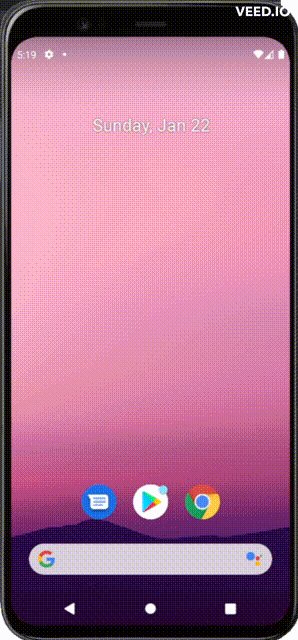

# Android-Studio-Drawables_Styles_Themes

<details>

**<summary>Application Images</summary>**



</details>

## **Code**

<ul>

### <li>**Java files**

<ul>

<li>

<details>

**<summary>`MainActivity.java`</summary>**

```java
package com.example.scorekeeper;

import androidx.appcompat.app.AppCompatActivity;
import androidx.appcompat.app.AppCompatDelegate;

import android.os.Bundle;
import android.view.Menu;
import android.view.MenuItem;
import android.widget.ImageButton;
import android.widget.TextView;

public class MainActivity extends AppCompatActivity {


    TextView team1Score;
    ImageButton team1Increment;
    ImageButton team1Decrement;

    TextView team2Score;
    ImageButton team2Increment;
    ImageButton team2Decrement;


    @Override
    protected void onCreate(Bundle savedInstanceState) {
        super.onCreate(savedInstanceState);
        setContentView(R.layout.activity_main);


        this.team1Score = this.findViewById(R.id.team1Score);
        this.team1Increment = this.findViewById(R.id.team1Increment);
        this.team1Decrement = this.findViewById(R.id.team1Decrement);

        this.team2Score = this.findViewById(R.id.team2Score);
        this.team2Increment = this.findViewById(R.id.team2Increment);
        this.team2Decrement = this.findViewById(R.id.team2Decrement);


        this.team1Score.setText("0");
        this.team2Score.setText("0");


        this.team1Increment.setOnClickListener(view -> this.increaseScore(this.team1Score));
        this.team1Decrement.setOnClickListener(view -> this.decreaseScore(this.team1Score));

        this.team2Increment.setOnClickListener(view -> this.increaseScore(this.team2Score));
        this.team2Decrement.setOnClickListener(view -> this.decreaseScore(this.team2Score));


        if (savedInstanceState != null) {
            int mScore1 = savedInstanceState.getInt("STATE_SCORE_1");
            int mScore2 = savedInstanceState.getInt("STATE_SCORE_2");

            this.team1Score.setText(String.valueOf(mScore1));
            this.team2Score.setText(String.valueOf(mScore2));
        }


    }


    private void increaseScore(TextView textView) {

        int scoreBefore = Integer.parseInt((String) textView.getText());
        textView.setText(String.valueOf(scoreBefore + 1));

    }


    private void decreaseScore(TextView textView) {

        if (Integer.parseInt((String) textView.getText()) > 0) {

            int scoreBefore = Integer.parseInt((String) textView.getText());
            textView.setText(String.valueOf(scoreBefore - 1));

        }

    }

    @Override
    public boolean onCreateOptionsMenu(Menu menu) {
        super.onCreateOptionsMenu(menu);


        getMenuInflater().inflate(R.menu.main_menu, menu);

        int nightMode = AppCompatDelegate.getDefaultNightMode();

        if (nightMode == AppCompatDelegate.MODE_NIGHT_YES) {
            menu.findItem(R.id.night_mode).setTitle(R.string.day_mode);
        } else {
            menu.findItem(R.id.night_mode).setTitle(R.string.night_mode);
        }


        return true;
    }


    @Override
    public boolean onOptionsItemSelected(MenuItem item) {


        if (item.getItemId() == R.id.night_mode) {

            int nightMode = AppCompatDelegate.getDefaultNightMode();

            if (nightMode == AppCompatDelegate.MODE_NIGHT_YES) {
                AppCompatDelegate.setDefaultNightMode(AppCompatDelegate.MODE_NIGHT_NO);
            } else {
                AppCompatDelegate.setDefaultNightMode(AppCompatDelegate.MODE_NIGHT_YES);
            }

            recreate();

        }


        return true;
    }


    @Override
    protected void onSaveInstanceState(Bundle outState) {

        outState.putInt("STATE_SCORE_1", Integer.parseInt((String) this.team1Score.getText()));
        outState.putInt("STATE_SCORE_2", Integer.parseInt((String) this.team2Score.getText()));


        super.onSaveInstanceState(outState);
    }

}
```

</details>

</li>

</ul>

</li>

### <li>**XML files**

<ul>

#### <li>**`drawable`**

<ul>

<li>

<details>

**<summary>`button_background.xml`</summary>**

```xml
<?xml version="1.0" encoding="utf-8"?>
<shape xmlns:android="http://schemas.android.com/apk/res/android"
    android:shape="oval">
    <stroke
        android:width="2dp"
        android:color="@color/purple_500" />
</shape>
```

</details>

</li>

<li>

<details>

**<summary>`button_pressed.xml`</summary>**

```xml
<?xml version="1.0" encoding="utf-8"?>
<shape xmlns:android="http://schemas.android.com/apk/res/android"
    android:shape="oval">
    <solid
        android:width="2dp"
        android:color="@color/purple_500" />
</shape>
```

</details>

</li>

<li>

<details>

**<summary>`selector_button.xml`</summary>**

```xml
<?xml version="1.0" encoding="utf-8"?>
<selector xmlns:android="http://schemas.android.com/apk/res/android">

    <item android:drawable="@drawable/button_background" android:state_pressed="false" />
    <item android:drawable="@drawable/button_pressed" android:state_pressed="true" />

</selector>
```

</details>

</li>

<li>

<details>

**<summary>`ic_minus.xml`</summary>**

```xml
<vector xmlns:android="http://schemas.android.com/apk/res/android"
    android:width="40dp"
    android:height="40dp"
    android:tint="#000000"
    android:viewportWidth="24"
    android:viewportHeight="24">
    <path
        android:fillColor="@android:color/white"
        android:pathData="M19,13H5v-2h14v2z" />
</vector>

```

</details>

</li>

<li>

<details>

**<summary>`ic_minus_pressed.xml`</summary>**

```xml
<vector xmlns:android="http://schemas.android.com/apk/res/android"
    android:width="40dp"
    android:height="40dp"
    android:tint="@color/white"
    android:viewportWidth="24"
    android:viewportHeight="24">
    <path
        android:fillColor="@android:color/white"
        android:pathData="M19,13H5v-2h14v2z" />
</vector>

```

</details>

</li>

<li>

<details>

**<summary>`selector_minus.xml`</summary>**

```xml
<?xml version="1.0" encoding="utf-8"?>
<selector xmlns:android="http://schemas.android.com/apk/res/android">

    <item android:drawable="@drawable/ic_minus" android:state_pressed="false" />
    <item android:drawable="@drawable/ic_minus_pressed" android:state_pressed="true" />

</selector>
```

</details>

</li>

<li>

<details>

**<summary>`ic_plus.xml`</summary>**

```xml
<vector xmlns:android="http://schemas.android.com/apk/res/android"
    android:width="40dp"
    android:height="40dp"
    android:tint="#000000"
    android:viewportWidth="24"
    android:viewportHeight="24">
    <path
        android:fillColor="@android:color/white"
        android:pathData="M19,13h-6v6h-2v-6H5v-2h6V5h2v6h6v2z" />
</vector>

```

</details>

</li>

<li>

<details>

**<summary>`ic_plus_pressed.xml`</summary>**

```xml
<vector xmlns:android="http://schemas.android.com/apk/res/android"
    android:width="40dp"
    android:height="40dp"
    android:tint="@color/white"
    android:viewportWidth="24"
    android:viewportHeight="24">
    <path
        android:fillColor="@android:color/white"
        android:pathData="M19,13h-6v6h-2v-6H5v-2h6V5h2v6h6v2z" />
</vector>

```

</details>

</li>

<li>

<details>

**<summary>`selector_plus.xml`</summary>**

```xml
<?xml version="1.0" encoding="utf-8"?>
<selector xmlns:android="http://schemas.android.com/apk/res/android">

    <item android:drawable="@drawable/ic_plus" android:state_pressed="false" />
    <item android:drawable="@drawable/ic_plus_pressed" android:state_pressed="true" />

</selector>
```

</details>

</li>

</ul>

</li>

#### <li>**`layout`**

<ul>

<li>

<details>

**<summary>`activity_main.xml`</summary>**

```xml
<?xml version="1.0" encoding="utf-8"?>
<LinearLayout xmlns:android="http://schemas.android.com/apk/res/android"
    xmlns:app="http://schemas.android.com/apk/res-auto"
    xmlns:tools="http://schemas.android.com/tools"
    android:layout_width="match_parent"
    android:layout_height="match_parent"
    android:orientation="vertical"
    android:padding="10dp"
    tools:context=".MainActivity">


    <RelativeLayout
        android:layout_width="match_parent"
        android:layout_height="0dp"
        android:layout_weight="1">

        <TextView
            android:id="@+id/nameTeam1"
            style="@style/TeamText"
            android:layout_width="wrap_content"
            android:layout_height="wrap_content"
            android:layout_centerInParent="true"
            android:text="@string/name_team_1" />


        <ImageButton
            android:id="@+id/team1Decrement"
            style="@style/MinusButtons"
            android:layout_width="@dimen/sizeButtons"
            android:layout_height="@dimen/sizeButtons"
            android:layout_below="@+id/nameTeam1"
            android:contentDescription="@string/description_minus_button" />

        <TextView
            android:id="@+id/team1Score"
            style="@style/ScoreText"
            android:layout_width="wrap_content"
            android:layout_height="wrap_content"
            android:layout_below="@+id/nameTeam1"
            android:layout_centerHorizontal="true"
            android:textSize="40sp" />

        <ImageButton
            android:id="@+id/team1Increment"
            style="@style/PlusButtons"
            android:layout_width="@dimen/sizeButtons"
            android:layout_height="@dimen/sizeButtons"
            android:layout_below="@+id/nameTeam1"
            android:layout_alignParentEnd="true"
            android:contentDescription="@string/description_plus_button" />


    </RelativeLayout>


    <RelativeLayout
        android:layout_width="match_parent"
        android:layout_height="0dp"
        android:layout_weight="1">

        <TextView
            android:id="@+id/nameTeam2"
            style="@style/TeamText"
            android:layout_width="wrap_content"
            android:layout_height="wrap_content"
            android:layout_centerInParent="true"
            android:text="@string/name_team_2" />


        <ImageButton
            android:id="@+id/team2Decrement"
            style="@style/MinusButtons"
            android:layout_width="@dimen/sizeButtons"
            android:layout_height="@dimen/sizeButtons"
            android:layout_below="@+id/nameTeam2"
            android:contentDescription="@string/description_minus_button" />

        <TextView
            android:id="@+id/team2Score"
            style="@style/ScoreText"
            android:layout_width="wrap_content"
            android:layout_height="wrap_content"
            android:layout_below="@+id/nameTeam2"
            android:layout_centerHorizontal="true"
            android:textSize="40sp" />

        <ImageButton
            android:id="@+id/team2Increment"
            style="@style/PlusButtons"
            android:layout_width="@dimen/sizeButtons"
            android:layout_height="@dimen/sizeButtons"
            android:layout_below="@+id/nameTeam2"
            android:layout_alignParentEnd="true"
            android:contentDescription="@string/description_plus_button" />


    </RelativeLayout>


</LinearLayout>
```

</details>

</li>

</ul>

#### <li>**`menu`**

<ul>

<li>

<details>

**<summary>`main_menu.xml`</summary>**

```xml
<?xml version="1.0" encoding="utf-8"?>
<menu xmlns:android="http://schemas.android.com/apk/res/android"
    xmlns:app="http://schemas.android.com/apk/res-auto">

    <item
        android:id="@+id/night_mode"
        android:title="@string/night_mode"
        app:showAsAction="ifRoom" />

</menu>
```

</details>

</li>

</ul>

</li>

#### <li>**`values`**

<ul>

<li>

<details>

**<summary>`colors.xml`</summary>**

```xml
<?xml version="1.0" encoding="utf-8"?>
<resources>
    <color name="purple_200">#FFBB86FC</color>
    <color name="purple_500">#FF6200EE</color>
    <color name="purple_700">#FF3700B3</color>
    <color name="teal_200">#FF03DAC5</color>
    <color name="teal_700">#FF018786</color>
    <color name="black">#FF000000</color>
    <color name="white">#FFFFFFFF</color>
</resources>
```

</details>

</li>

<li>

<details>

**<summary>`dimen.xml`</summary>**

```xml
<?xml version="1.0" encoding="utf-8"?>
<resources>

    <dimen name="sizeButtons">70dp</dimen>

</resources>
```

</details>

</li>

<li>

<details>

**<summary>`strings.xml`</summary>**

```xml
<resources>
    <string name="app_name">Scorekeeper</string>
    <string name="description_minus_button">Minus Button</string>
    <string name="description_plus_button">Plus Button</string>
    <string name="name_team_1">Team 1</string>
    <string name="name_team_2">Team 2</string>

    <string name="night_mode">Night Mode</string>
    <string name="day_mode">Day Mode</string>

</resources>
```

</details>

</li>

<li>

<details>

**<summary>`styles.xml`</summary>**

```xml
<?xml version="1.0" encoding="utf-8"?>
<resources>


    <style name="AppTheme" parent="Theme.AppCompat.DayNight.DarkActionBar" />


    <style name="ScoreButtons" parent="Widget.AppCompat.Button">
        <item name="android:background">@drawable/selector_button</item>
        <item name="color">@color/purple_500</item>
    </style>


    <style name="PlusButtons" parent="ScoreButtons">
        <item name="android:src">@drawable/selector_plus</item>
        <item name="android:contentDescription">@string/description_plus_button</item>
    </style>


    <style name="MinusButtons" parent="ScoreButtons">
        <item name="android:src">@drawable/selector_minus</item>
        <item name="android:contentDescription">@string/description_minus_button</item>
    </style>


    <style name="ScoreText">
        <item name="android:textAppearance">@style/TextAppearance.AppCompat.Display3</item>
    </style>


    <style name="TeamText">
        <item name="android:textAppearance">@style/TextAppearance.AppCompat.Display1</item>
    </style>


</resources>
```

</details>

</li>

</ul>

</li>

</ul>

</li>

</ul>

</ul>
